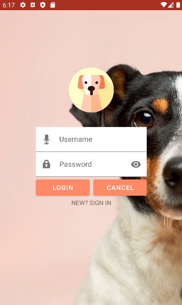
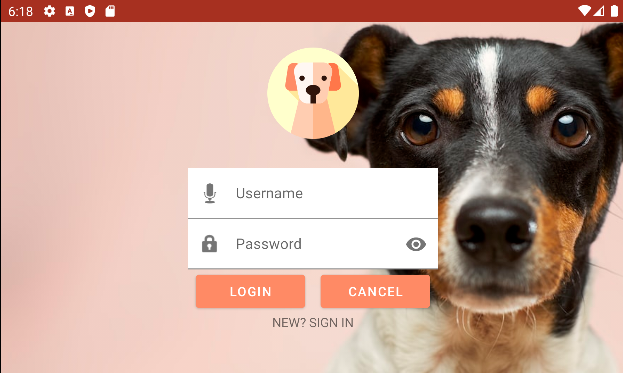
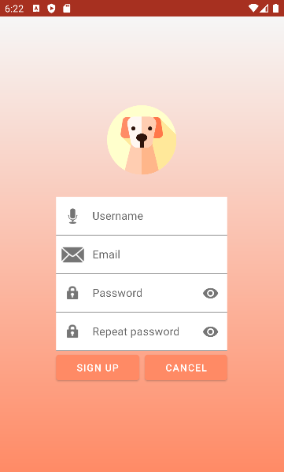
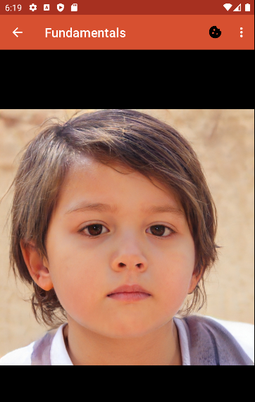
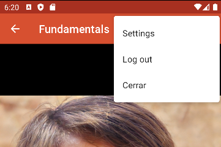
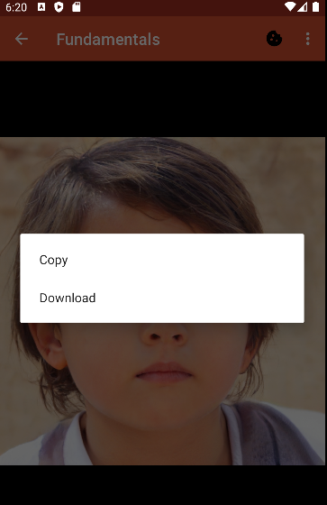

# Daniel's FIRST project

## SplashActivity
  [XML](https://github.com/Daniel-Mora-Moreno/First/blob/master/app/src/main/res/layout/activity_splash.xml) - [Java](https://github.com/Daniel-Mora-Moreno/First/tree/master/app/src/main/java/com/dmora/first/SplashActivity.java)
  
  Contains:
  * Main logo with fade-in and zoom-in glide animations
  * Creator's name (that's me!)
  * Background image with translation glide animation
  
  
  
## LoginActivity
  [XML](https://github.com/Daniel-Mora-Moreno/First/blob/master/app/src/main/res/layout/activity_login.xml) - [XML(landscape)](https://github.com/Daniel-Mora-Moreno/First/blob/master/app/src/main/res/layout-land/activity_login.xml) - [Java](https://github.com/Daniel-Mora-Moreno/First/tree/master/app/src/main/java/com/dmora/first/LoginActivity.java)
  
  Contains:
  * Main logo
  * Background image loaded from a URL
  * Username and Password functionalities (not implemented)
  * Login button that takes you to Main
  * Sign up option that leads you to the Sign Up page
  * No option to go back to the Splash
  
  
  

## SignUpActivity
  [XML](https://github.com/Daniel-Mora-Moreno/First/blob/master/app/src/main/res/layout/activity_signup.xml)- [Java](https://github.com/Daniel-Mora-Moreno/First/tree/master/app/src/main/java/com/dmora/first/SignUpActivity.java)

  Contains:
  * Main logo
  * Gradient background
  * Similar fields to those of the Login page

  

## Main
  [XML](https://github.com/Daniel-Mora-Moreno/First/blob/master/app/src/main/res/layout/activity_main.xml)- [Java](https://github.com/Daniel-Mora-Moreno/First/tree/master/app/src/main/java/com/dmora/first/Main.java)

  Contains:
  * WebView linked to https://thispersondoesnotexist.com
  * Auto-refresh on swipe
  * Toolbar with options to give cookies or go back to the Login
  * Menu on long-press
  
  
  
  
